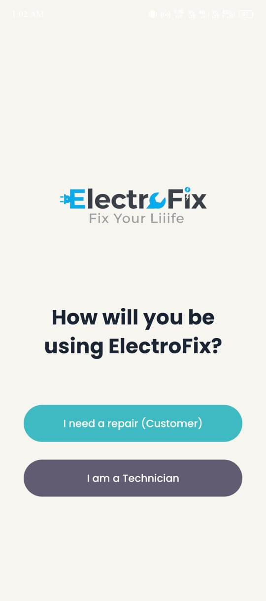
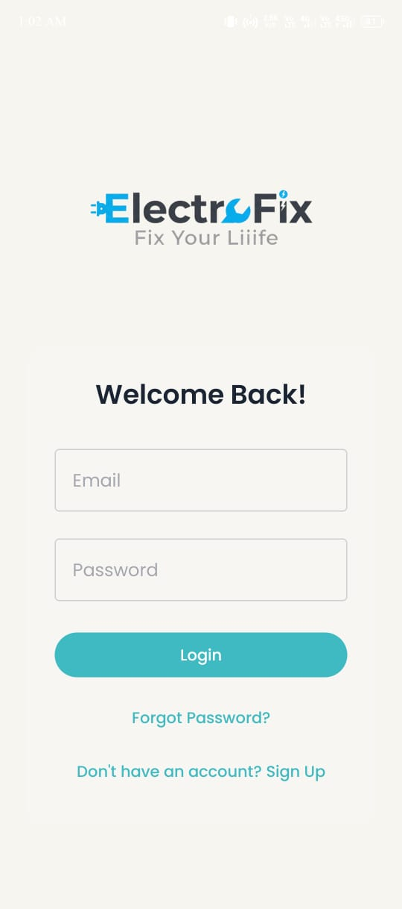
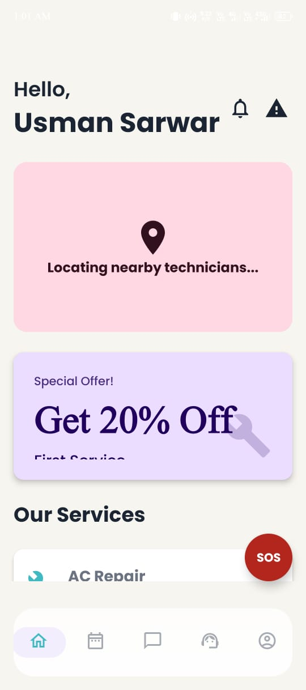
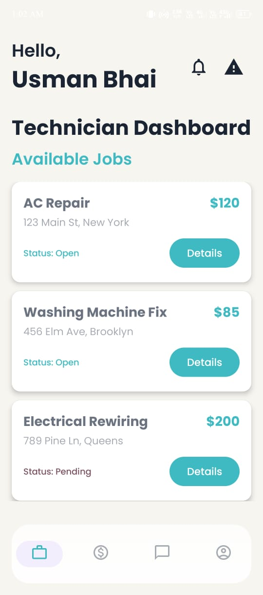
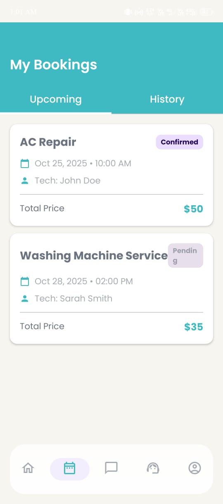
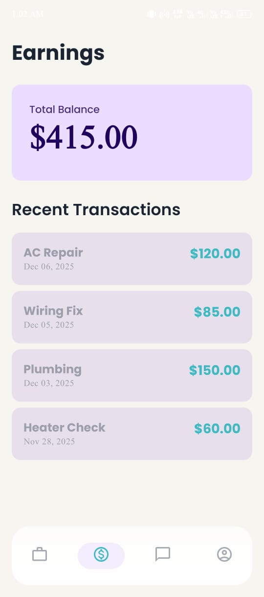
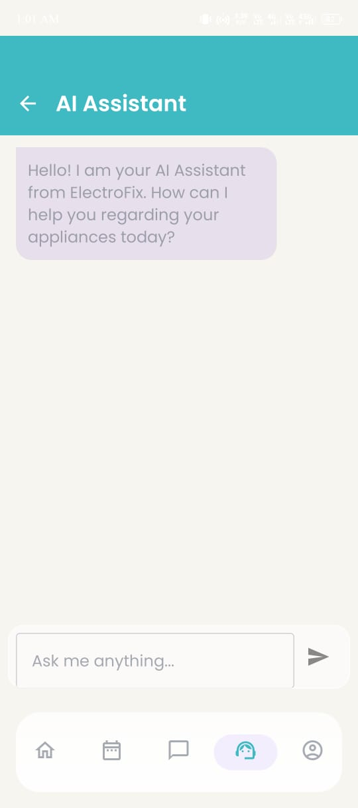
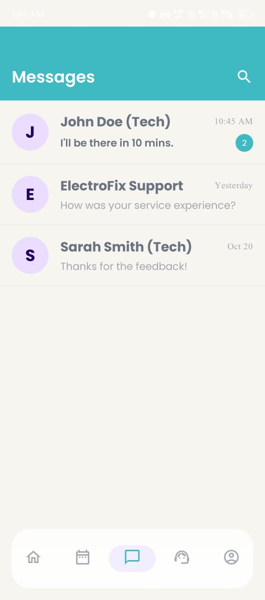
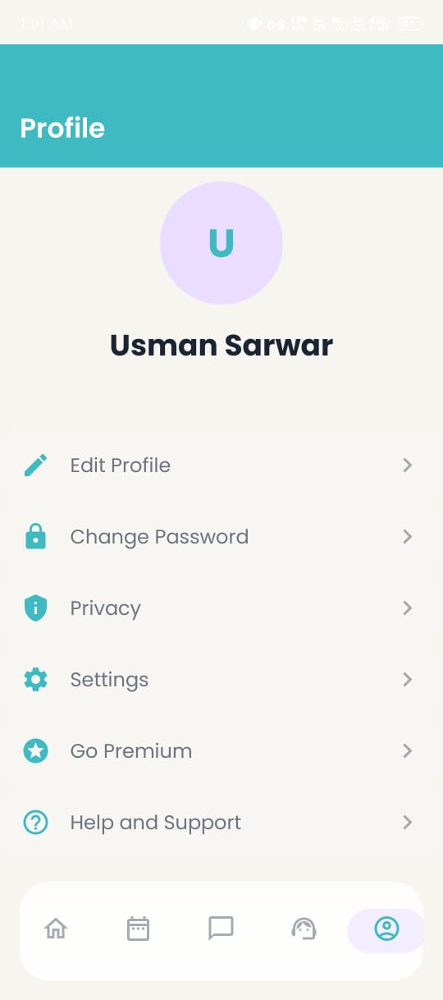

# ElectroFix ⚡📍✅
> **Fix Your Liiife.**

[](https://kotlinlang.org)
[](https://developer.android.com/jetpack/compose)
[]()
[]()

## 📋 About The Project

**ElectroFix** is an on-demand mobile platform that connects users with verified electrical and electronic repair technicians in real-time. 

Whether it's a blown fuse, a malfunctioning appliance, or complex wiring issues, ElectroFix brings the solution to your doorstep with speed and reliability. Our goal is to remove the friction from home maintenance.

### Key Visual Identity
Our identity is built on three pillars, reflected in our logo:
* **Location Pin:** We are hyper-local and arrive where you are.
* **Lightning Bolt:** We provide rapid, energetic service.
* **Checkmark:** Every technician is background-checked and verified.

## ✨ Features

* **📍 Real-Time Geolocation:** Find the nearest available electrician using interactive maps.
* **⚡ Instant Booking:** "Emergency Mode" to get a technician in under 30 minutes.
* **🛡️ Verified Professionals:** All registered technicians undergo a strict KYC and skill verification process.
* **💬 In-App Chat:** Communicate with your fixer directly within the app.
* **💳 Secure Payments:** Integrated payment gateway for cashless transactions.
* **🌙 Modern UI:** Built with a premium Dark Theme and Glassmorphism elements for a sleek user experience.

## 📱 Screenshots

| Splash Screen | Auth | Login | Customer Home | Technician Home | Booking | Earning | Chatbot | Messages | Profile |
|:---:|:---:|:---:|:---:|:---:|:---:|:---:|:---:|:---:|:---:|
|  |  |  |  |  |  |  |  |  |  |


## 🛠️ Tech Stack

This project is built using modern Android development standards.

* **Language:** [Kotlin](https://kotlinlang.org/)
* **UI Framework:** [Jetpack Compose](https://developer.android.com/jetpack/compose) (Material 3 Design)
* **Architecture:** MVVM (Model-View-ViewModel)
* **Navigation:** Jetpack Compose Navigation
* **Networking:** Retrofit & OkHttp
* **Dependency Injection:** Hilt
* **Asynchronous:** Coroutines & Flow
* **Maps:** Google Maps SDK for Android
* **Backend (Optional/Planned):** Node.js / Firebase / Python (FastAPI)

## 🚀 Getting Started

Follow these steps to get a local copy up and running.

### Prerequisites

* Android Studio Hedgehog or newer.
* JDK 17.
* A Google Maps API Key (for the map functionality).

### Installation

1.  **Clone the repository**
    ```bash
    git clone [https://github.com/Usmansarwar143/ElectroFix.git](https://github.com/your-username/ElectroFix.git)
    ```
2.  **Open in Android Studio**
    * File > Open > Select the `ElectroFix` folder.
3.  **Add API Keys**
    * Create a `local.properties` file in the root directory if it doesn't exist.
    * Add your Google Maps key:
        ```properties
        MAPS_API_KEY=your_actual_api_key_here
        ```
4.  **Sync Gradle**
    * Click "Sync Now" in the top bar.
5.  **Run the App**
    * Select an emulator or connect your physical device and press **Run**.

## 🤝 Contributing

Contributions are what make the open-source community such an amazing place to learn, inspire, and create. Any contributions you make are **greatly appreciated**.

1.  Fork the Project
2.  Create your Feature Branch (`git checkout -b feature/AmazingFeature`)
3.  Commit your Changes (`git commit -m 'Add some AmazingFeature'`)
4.  Push to the Branch (`git push origin feature/AmazingFeature`)
5.  Open a Pull Request

## 🗺️ Roadmap

- [x] Initial UI Design (Logo & Splash Screen)
- [ ] User Authentication (Login/Signup)
- [ ] Map Integration & Location Permission
- [ ] Technician Listing Interface
- [ ] Booking Flow Logic
- [ ] Payment Gateway Integration

## 📄 License

Distributed under the MIT License. See `LICENSE` for more information.

## 📞 Contact

**Founder/Developer:** [Muhammad Usman Sarwar & Abdul Moiz Barlas]  
**Email:** [muhammadusman.becsef22@iba-suk.edu.pk]  
**LinkedIn:** [https://www.linkedin.com/in/muhammad-usman-018535253]

---
*Built with ❤️ to Fix Your Liiife.*
